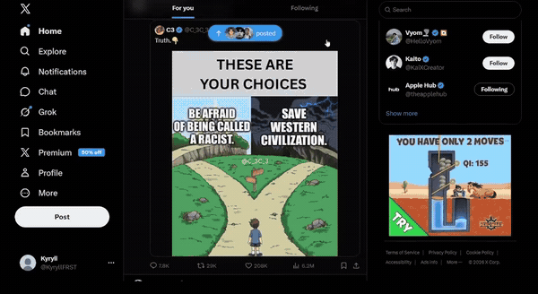

<h1 align="center">👁️ Eye Scroll</h1>

<p align="center">
  <b>Scroll any page with your eyes. No hands, no hardware — just your webcam.</b><br>
  Look down to scroll down, look up to scroll up. Works in Chrome, VS Code, chats — anything.
</p>

<p align="center">
  
</p>

<p align="center">
  <a href="../../releases/latest"></a>
  
  
  
</p>

---

**Eye Scroll** is a tiny, free, open-source app that turns your webcam into a hands-free
scroll wheel. It runs quietly in your **system tray** and works system-wide — no browser
extension, no special hardware, no setup.

- 🖐️ **Hands-free** — read articles, docs, or code while eating, sketching, or resting your wrists.
- ♿ **Accessible** — built-in scrolling for anyone who can't easily use a mouse or trackpad.
- 🪟 **Works everywhere** — Chrome, VS Code, PDFs, chat apps. If it scrolls, this scrolls it.
- 🧘 **Calm by design** — a center "reading zone" holds the page still while you read.
- 🔒 **100% local** — all processing is on-device. No video ever leaves your machine.

### ⬇️ Install in 10 seconds

1. **[Download the latest release](../../releases/latest)** for your OS.
2. Double-click to run. A tray icon appears.
3. Look straight ahead for 2 seconds while it calibrates — then look up/down to scroll.

> 💡 The scroll goes to whatever window is **under your mouse pointer**, so just hover the
> pointer over the page you want to scroll. No clicking needed.

⭐ **If this is useful or fun, please star the repo** — it genuinely helps other people find it.

## How it works

- **Look down** past the reading zone → scroll down. **Look up** → scroll up.
- The middle **reading zone** is a calm band where nothing scrolls, so you can read
  freely. Bring content into the middle and it settles there (anchored).
- Gaze is measured from the iris position relative to your **eye corners** (a stable
  reference that doesn't move when your eyelids do), normalized for camera distance.

## Using the app

Launch it and a tray icon appears (green = active, grey = paused). On first launch it
**auto-calibrates** — look straight ahead for ~2 seconds when you see the notification.

Right-click the tray icon for:

| Menu item | What it does |
|-----------|--------------|
| **Pause / Resume scrolling** | Stops tracking and releases the camera (light off). |
| **Recalibrate** | Re-measures your straight-ahead gaze. Look straight, then click. |
| **Show camera preview** | Optional debug window showing the live `dev=` value. |
| **Quit** | Exit the app. |

Calibration is saved per-user, so it's remembered between runs.

## Per-OS permissions (important)

These are inherent to any app that uses the camera and controls input — not bugs:

- **Windows:** the unsigned `.exe` triggers a SmartScreen prompt the first time →
  *More info → Run anyway*. (Code-signing removes this.)
- **macOS:** grant **Camera** *and* **Accessibility** in
  *System Settings → Privacy & Security* (Accessibility is required for the app to
  send scroll events). An unsigned/un-notarized `.app` must be opened via
  *right-click → Open* the first time.
- **Linux:** requires an **X11** session (scrolling via `pyautogui` doesn't work on
  Wayland) plus `libGL`, `scrot`, and `python3-tk` installed.

## Run from source

```bash
pip install -r requirements.txt
python eyescroll_app.py
```

(`eye_scroll.py` is the original single-window version, kept for reference/tuning.)

## Building the apps

Builds are produced per-OS by **GitHub Actions** (`.github/workflows/build.yml`):

- Push this repo to GitHub.
- Run the **Build** workflow manually (Actions tab → Build → *Run workflow*) to get
  downloadable artifacts for all three OSes, **or**
- Push a version tag to also create a Release with the files attached:
  ```bash
  git tag v0.1.0 && git push origin v0.1.0
  ```

### Build locally instead

On the target OS:

```bash
pip install -r requirements.txt pyinstaller
# download the model next to the spec first:
python -c "import urllib.request; urllib.request.urlretrieve('https://storage.googleapis.com/mediapipe-models/face_landmarker/face_landmarker/float16/1/face_landmarker.task','face_landmarker.task')"
pyinstaller eyescroll.spec
# → dist/EyeScroll(.exe)  or  dist/EyeScroll.app
```

## Tuning

Edit `config.json` in your per-user app folder (created on first run):

- Windows: `%APPDATA%\EyeScroll\config.json`
- macOS: `~/Library/Application Support/EyeScroll/config.json`
- Linux: `~/.config/EyeScroll/config.json`

| Key | Effect |
|-----|--------|
| `reading_zone` | Bigger = larger calm band; smaller = scroll with less eye movement. |
| `gaze_range` | Smaller = reach max speed with less deflection (more sensitive). |
| `scroll_max_step` | Top scroll speed. |
| `ema_alpha_brake` | Higher = stops faster when you look back to center (less overshoot). |

## License

[MIT](LICENSE) — free to use, modify, and distribute.
